# Bank Customer Service Chatbot

A secure bank customer service chatbot with a **React + TypeScript frontend**, **Python Flask backend**, and security features.

## Key Features

### Architecture
- **Frontend-Backend Separation** - Separate React frontend and Flask backend apps
- **React + TypeScript** - Type-safe, scalable frontend
- **REST API** - Secure endpoints with server-side session state (in-memory)
- **Streaming Responses** - Server-Sent Events (SSE) for real-time chat

**Architecture Diagram:**


---

## Data Flow

### Message Flow Diagram

```mermaid
sequenceDiagram
   participant User as 👤 User
   participant Frontend as 🖥️ Frontend<br/>(React + TS)
   participant API as ⚙️ API<br/>(Flask)
   participant Middleware as 🔒 Middleware<br/>CORS + Limiter + Session ID check
   participant Session as 📋 Session<br/>Store
   participant Engine as 💬 ConversationSession
   participant Intent as 🧠 Intent<br/>Classifier
   participant Verify as ✓ Verification
   participant Response as 💬 Response<br/>Handler
   participant Data as 📊 Customer<br/>Data
   participant Audit as 🧾 Audit<br/>Logger

   User->>Frontend: Types message
   Frontend->>Frontend: useChat ensures session
   Frontend->>API: POST /api/session (if needed)
   API-->>Frontend: session_id
   Frontend->>API: GET /api/chat/session_id?message=... (SSE)
   Note over Frontend,API: POST /api/chat exists but frontend uses GET for streaming
    
   API->>Middleware: Rate limits + session ID check (GET/POST)
   alt GET /api/chat (query param)
      API->>API: Read message from query string
   else POST /api/chat (JSON)
      API->>Middleware: Content-Type check (POST only)
      API->>API: Parse JSON body + require message field
   end
   alt Invalid Input
      API-->>Frontend: 400 Bad Request
      Frontend-->>User: Show error
   else Valid Input
      API->>Session: Load session
      API->>API: Validate message (inline)
      API->>Engine: process_message(message)
      Engine->>Intent: Classify intent
      Intent-->>Engine: intent + confidence
      Note over Engine: Check if sensitive
        
      alt Sensitive Query
         Engine->>Verify: Check verification status
         alt Not Verified
            Engine->>Response: Build verification prompt
            Response-->>Engine: Verification required
         else Verified
            Engine->>Response: Generate response
            Response->>Data: Get customer info
            Data-->>Response: Return data
            Response-->>Engine: Generated response
         end
      else Public Query
         Engine->>Response: Generate response
         Response->>Data: Get info (if needed)
         Data-->>Response: Return info
         Response-->>Engine: Generated response
      end

      Engine->>Audit: Log sensitive access (if any)
      API-->>Frontend: SSE Stream<br/>data: {text chunks}<br/>data: {done: true}
      Frontend->>Frontend: useChat updates state
      Frontend-->>User: Display streaming response
   end
```



### Banking
- **Service Information** - Query available services
- **Branch Locator** - Find branch addresses & hours
- **Loan Process Guide** - Step-by-step loan application
- **Account Opening** - Account setup guidance
- **Sensitive Queries** - Account info (with verification)
- **Account Balance** - Verify and display balance
- **Loan Balance** - Check outstanding loans
- **Branch History** - Account opening location

## Quick Start

### Prerequisites
- **Python 3.8+** with pip
- **Node.js 14+** with npm/yarn
- **Git**

### One-Command Dev (Fixed Ports)

```bash
# Start both backend + frontend on fixed ports
npm run dev

# Run the smoke test (backend must be running)
npm run smoke

# Run backend tests
cd backend
python test_chatbot.py
```

## Security

This chatbot implements security controls grounded in the current codebase.

### Core Controls

- **Identity Verification** - Multi-field verification (name, DOB, ID) before sensitive data access
- **Session Management** - UUID session IDs stored server-side in memory with per-session isolation
- **Security Headers** - HSTS, CSP, X-Frame-Options, X-Content-Type-Options, etc.
- **CORS Protection** - Origin allowlist with allowed methods (GET, POST, DELETE, OPTIONS)
- **Rate Limiting** - Global and endpoint-specific limits via fixed-window strategy
- **Audit Logging** - Structured JSON events with redaction of session/customer IDs

### Security Headers

```
X-Content-Type-Options: nosniff
X-Frame-Options: DENY
X-XSS-Protection: 1; mode=block
Strict-Transport-Security: max-age=31536000; includeSubDomains
Cache-Control: no-store, no-cache, must-revalidate, max-age=0
Content-Security-Policy: default-src 'none'; frame-ancestors 'none'
Referrer-Policy: no-referrer
Permissions-Policy: geolocation=(), microphone=(), camera=()
```

### Rate Limiting

- **Global Limits**: 200 requests/hour, 50 requests/minute per IP
- **Endpoint-Specific Limits**:
   - Session creation: 10 requests/minute
   - Chat messages: 30 requests/minute
- **Strategy**: Fixed-window algorithm with in-memory storage
- **Error Handling**: 429 Too Many Requests

### Request Validation

- Session ID format validation (UUID)
- Chat message validation (required string, max 5000 chars, no null bytes)
- Content-Type validation for JSON POST/PUT/PATCH (`application/json` or `application/json; charset=utf-8`)
- Required `message` field enforcement for POST /api/chat

### Error Handling

- Handlers for 400, 404, 405, 429, 500
- 500/unexpected errors are sanitized before logging

### Audit Logging & Redaction

- **Structured JSON logs** in `backend/logs/audit.log`
- **Events Logged**:
   - Session created/deleted
   - Verification success/failure
   - Sensitive data access
   - Rate limit violations
- **Redaction**:
   - Audit logs mask session/customer IDs
   - Global log filter redacts API keys (32+ chars) and Taiwan IDs

### Frontend Security

- Session IDs stored in `sessionStorage` (no LocalStorage usage)

### Data Storage

- Customer records are configuration-based (no database in this sample)

## Technology Stack

### Backend
- Python 3.8+
- Flask 2.3+
- Flask-CORS 4.0+

### Frontend
- React 18+
- TypeScript 5+
- Axios (HTTP client)
- CSS3 (Styling)

## API Endpoints

| Method | Endpoint | Description |
|--------|----------|-------------|
| `GET` | `/api/health` | Health check |
| `POST` | `/api/session` | Create new session |
| `GET` | `/api/chat/<session_id>` | Send message via query param (SSE) |
| `POST` | `/api/chat/<session_id>` | Send message via JSON body (SSE) |
| `GET` | `/api/session/<session_id>/history` | Get conversation history |
| `DELETE` | `/api/session/<session_id>` | End session (logout) |

## API Examples

### POST /api/session - Create Session
- **General**: Creates a new chat session with a unique session ID
- **Request Arguments**: None
- **Returns**: A session object with `session_id` and `created_at` timestamp (HTTP 201)
- **Sample**: 
```bash
curl -X POST http://localhost:5001/api/session \
  -H "Content-Type: application/json"
```
**Response**:
```json
{
  "session_id": "550e8400-e29b-41d4-a716-446655440000",
  "created_at": "2024-01-15T10:30:00.123456"
}
```

### GET /api/chat/{session_id} - Send Message (SSE)
- **General**: Sends a message and receives a streaming response via Server-Sent Events
- **Request Arguments**: 
  - `session_id` (path parameter): The session ID
  - `message` (query parameter): The user's message
- **Returns**: Server-Sent Event stream with response chunks and completion flag
- **Sample**: 
```bash
curl -X GET "http://localhost:5001/api/chat/550e8400-e29b-41d4-a716-446655440000?message=What%20services%20do%20you%20offer%3F"
```
**Response (SSE Stream)**:
```
data: {"text": "Our available services are:"}
data: {"text": " 24/7 Customer Support,"}
data: {"text": " Account Management,"}
data: {"done": true}
```

### GET /api/session/{session_id}/history - Get Conversation History
- **General**: Retrieves the conversation history for a specific session
- **Request Arguments**: 
  - `session_id` (path parameter): The session ID
- **Returns**: Session history with conversation messages and message count (HTTP 200)
- **Sample**: 
```bash
curl -X GET http://localhost:5001/api/session/550e8400-e29b-41d4-a716-446655440000/history
```
**Response**:
```json
{
  "session_id": "550e8400-e29b-41d4-a716-446655440000",
  "history": [
    {
      "user": "What services do you offer?"
    },
    {
      "assistant": "Our available services are: 24/7 Customer Support, Account Management, Loan Services, Investment Advisory, Credit Card Services, Mobile Banking"
    },
    {
      "user": "What is my account balance?"
    },
    {
      "assistant": "For security reasons, I need to verify your identity before providing sensitive information..."
    }
  ],
  "count": 4
}
```

### DELETE /api/session/{session_id} - End Session
- **General**: Terminates a session and clears associated data
- **Request Arguments**: 
  - `session_id` (path parameter): The session ID to delete
- **Returns**: Deletion confirmation message (HTTP 200)
- **Sample**: 
```bash
curl -X DELETE http://localhost:5001/api/session/550e8400-e29b-41d4-a716-446655440000
```
**Response**:
```json
{
  "message": "Session deleted successfully"
}
```

## Example Interactions

### Example 1: Query Public Information
```
User: What services are available?
Bot: Our available services are:
- 24/7 Customer Support
- Account Management
- Loan Services
- Investment Advisory
- Credit Card Services
- Mobile Banking
```

### Example 2: Access Sensitive Information (With Verification)

#### Step 1: Request Sensitive Query
```
User: What is my account balance?
Bot: For security reasons, I need to verify your identity before providing sensitive information.

Please provide the following details:
1. Your full name
2. Your date of birth (YYYY/MM/DD)
3. Your ID number
```

#### Step 2: Provide Verification Information
```
User: Tony Stark, 1996/09/10, A234763849
Bot: ✓ Identity verified successfully!

Your current account balance is: TWD 2,500,394
```

### Example 3: Failed Verification
```
User: What is my account balance?
Bot: For security reasons, I need to verify your identity before providing sensitive information...

User: John Doe, 2000/01/01, B123456789
Bot: Verification failed: Customer ID not found
Attempts remaining: 2
Please try again with correct information.
```

### Example 4: Invalid Input Format
```
User: What is my account balance?
Bot: For security reasons, I need to verify your identity...

User: Tony Stark
Bot: Please provide all required information. You still need to provide 2 more field(s).
Format: Name, Date of Birth (YYYY/MM/DD), ID Number
Or provide them one per line.
```

## Query Types

### Public Queries (No Verification)
1. **Service Items**
   - Keywords: "service", "offerings", "what can you do", "products"
   - Example: "What services do you offer?"

2. **Branch Information**
   - Keywords: "branch", "address", "location", "contact", "phone"
   - Example: "Where are your branches?"

3. **Loan Process**
   - Keywords: "loan", "borrow", "application", "process"
   - Example: "How do I apply for a loan?"

4. **Account Opening**
   - Keywords: "account", "open", "register", "sign up"
   - Example: "How do I open an account?"

### Sensitive Queries (Requires Verification)
1. **Bank Account Number**
   - Keywords: "account number", "bank account", "my account"
   - Example: "What is my account number?"

2. **Account Balance**
   - Keywords: "balance", "how much", "account balance"
   - Example: "What is my account balance?"

3. **Loan Balance**
   - Keywords: "loan balance", "owe", "outstanding"
   - Example: "What is my loan balance?"

4. **Opening Branch**
   - Keywords: "opening branch", "where opened"
   - Example: "Which branch is my account from?"

## Verification Information

### Test Customer
Use this information for testing verification:
- **Name**: Tony Stark
- **Date of Birth**: 1996/09/10
- **ID Number**: A234763849

### Verification Format
Provide credentials in one of these formats:
- Comma-separated: `Tony Stark, 1996/09/10, A234763849`

### Important
- Name matching is case-insensitive
- DOB must be in YYYY/MM/DD format
- Taiwan IDs: 1 letter + 9 digits
- Maximum 3 verification attempts per query
- After 3 failed attempts, you must use `logout` to reset

## Error Handling

### Input Errors
```
User: John Doe (only name provided for verification)
Bot: Please provide all required information. You still need to provide 2 more field(s).
```

### Verification Errors
```
User: Tony Stark, 1990/01/01, A234763849 (wrong DOB)
Bot: Verification failed: Date of birth does not match
Attempts remaining: 2
```

### Format Errors
```
User: Tony Stark, 10-9-1996, A234763849 (wrong date format)
Bot: Verification failed: Invalid date of birth format (use YYYY/MM/DD)
```
### Demonstration


#### Setup
